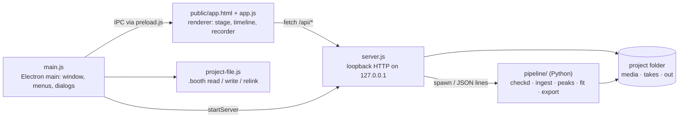

<h1 align="center">
  
  Booth
</h1>

<p align="center">
  Record, check and edit an Arabic voice-over against the picture, then export the dub.
  <br>
  <sub>Desktop app · Electron · Node · Python pipeline · Apache-2.0</sub>
</p>

Booth is the recording and review cockpit for a dub. Import the translation script and the source video, and Booth builds a line list with a time slot for every cue. The actor records each line while watching the picture. A local speech model checks every take as it lands. You then drag, stretch or cut the clips on a timeline, hear the change straight away, and export a narration stem, a mix or a dubbed MP4.

## Features

- **Projects as `.booth` files.** A small file stores edit state and *references* to your media. Media is never embedded. Each reference keeps both a relative and an absolute path, so a moved folder still opens and missing files can be relinked.
- **Import** a translation script (`.xlsx` / `.srt`) and a video (`.mp4`, `.mov`, `.mkv`, `.m4v`, `.webm`). Large files are hardlinked into the project when they're on the same drive, and on another drive you can reference them instead of copying.
- **Record against picture** with a count-in, a live input meter, and pause/hold on <kbd>Space</kbd>. Browser voice processing (echo cancellation, noise suppression, auto gain) is turned off. Takes are saved as 24-bit WAV.
- **Per-take checks** from a long-running Python/Whisper checker. It gives a verdict, speech length, headroom and warnings. Recording still works without it.
- **Timeline editing.** Every line renders to its own clip, so moving, stretching, cutting or swapping a take is audible right away, with no full re-assembly.
- **Review:** multiple takes per line, flags, status counts, and cues that stay in the original language shown as hatched bands.
- **Export** a narration stem (WAV), a ducked and normalised mix (WAV), or a dubbed video (MP4 with the video stream copied). Export the full film or only the recorded span.

## How it works



The UI talks to a local HTTP server instead of using IPC. The guide video can be a multi-GB master that has to jump to any timecode on every take, and byte-range streaming over `127.0.0.1` makes that instant. The server listens only on loopback. It runs the checker (`python -m pipeline.checkd`) as a long-lived daemon and spawns the other pipeline steps on demand.

## Requirements

- [Node.js](https://nodejs.org/) LTS and npm
- Python 3.12 as `python` on `PATH`, with `numpy` (`pip install numpy`)
- `ffmpeg` on `PATH`, built with the `rubberband` filter (e.g. the gyan.dev full build on Windows)
- A whisper.cpp build for the speech checker, with `bin/` and `models/ggml-arabic-turbo.bin`. Point `WHISPER_DIR` at it (default `E:\whisper`)

In development Booth runs the pipeline from `pipeline/` in this repo. Packaged builds ship `pipeline/` (without `__pycache__`) and `RUNBOOK.md` as `extraResources`.

## Getting started

```bash
# 1. Install Electron and electron-builder
npm install

# 2. Launch the desktop app
npm start
```

On the welcome screen choose **New project…**, then import the translation script and the video.

## Commands

| Command | What it does |
| --- | --- |
| `npm install` | Installs Electron and electron-builder |
| `npm start` | Runs the desktop app (`electron .`) |
| `npm run serve -- --root <dir> [--port 7800] [--python python] [--no-asr]` | Runs the local service headless for development. Open `http://127.0.0.1:7800/app.html` |
| `npm run pack` | Builds an unpacked Windows app into `dist/` (quick packaging check) |
| `npm run dist` | Builds the Windows NSIS installer and portable `.exe` into `dist/` |
| `npm run icons` | Regenerates `build/icon.ico`, `icon.png` and `icon_256.png` from `booth.png` at the repo root (needs `ffmpeg`) |

The pipeline steps the app runs can also be run by hand from the repo root. Pass `--project` so they don't default to `./project`:

```bash
python -m pipeline.ingest    --project "<dub>/project/project.json" --xlsx script.xlsx --video film.mp4 --force
python -m pipeline.fit       --project "<dub>/project/project.json"
python -m pipeline.recheck   --project "<dub>/project/project.json"
python -m pipeline.export    --project "<dub>/project/project.json" --what mix --out mix.wav
```

See [RUNBOOK.md](RUNBOOK.md) for every step (`salvage`, `preflight`, `reattach`, …), the verdict tables and the project format.

Useful environment variables:

| Variable | Purpose |
| --- | --- |
| `BOOTH_PROJECT` | Path to a `.booth` file to open at launch |
| `BOOTH_ROOT` | Folder to search for a project |
| `WHISPER_DIR` | Whisper build used by the speech checker |

The app log is at `<userData>/booth.log`. Open it with **Project → Open log**.

## Keyboard

| Key | Action |
| --- | --- |
| <kbd>R</kbd> | Start / finish a take |
| <kbd>Space</kbd> | Play / pause (holds a take while recording) |
| <kbd>Esc</kbd> | Abort the take |
| <kbd>F</kbd> | Flag the line |
| <kbd>Del</kbd> | Remove the clip from the timeline (the recording is kept) |
| <kbd>←</kbd> / <kbd>→</kbd> | Previous / next line |

## Project structure

```text
booth/
├── main.js           # Electron main: window, menus, project open/new/import, export dialogs
├── preload.js        # contextBridge API exposed to the page as window.booth
├── server.js         # Loopback HTTP service: media streaming, takes, checker daemon, pipeline steps
├── project-file.js   # The .booth format: references, layout, validation, relinking
├── public/
│   ├── startup.html  # Welcome / loading / error screen
│   ├── app.html      # Main view: stage, timeline, export dialog (markup + styles)
│   └── app.js        # Renderer: playback scheduling, recording, timeline editing
├── build/
│   ├── icon.ico      # Windows app, installer and file-association icon
│   ├── icon.png      # 512px icon (Linux/macOS, README)
│   ├── icon_256.png  # 256px icon
│   └── make_icons.py # Generates the icons from booth.png
├── pipeline/         # Python (stdlib + ffmpeg): run as `python -m pipeline.<step>`
│   ├── checkd.py     # Long-running checker daemon: take verdicts, per-clip re-renders
│   ├── ingest.py     # Script + video → project.json, extracted audio
│   ├── peaks.py      # Waveform peaks for the timeline
│   ├── fit.py        # Assembles takes onto the timeline (trim, borrow, stretch)
│   ├── export.py     # Narration stem, mix, dubbed MP4
│   ├── recheck.py    # Replays stored verdicts through the current checker
│   ├── preflight.py  # Estimates which lines can be spoken in time
│   ├── salvage.py    # Recovers takes from earlier recording sessions
│   ├── reattach.py   # Re-links take files missing from project.json
│   └── dubkit/       # Shared helpers: arabic, asr, ff, project, silence, srt, wav, xlsx
├── RUNBOOK.md        # Operator guide: every pipeline step, verdicts, project format
└── package.json      # Scripts and electron-builder configuration
```

A project on disk looks like this:

```text
My dub/
├── My dub.booth      # edit state + media references
└── project/
    ├── project.json  # line list, takes, fits (pipeline data)
    ├── media/        # source video, extracted audio
    ├── takes/        # recorded WAVs
    ├── out/          # exports
    └── cache/
```

## License

[Apache License 2.0](LICENSE)
